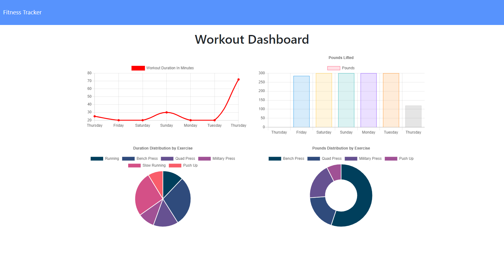

# **Fitness Tracker**

[](#) [](#) [](#) [](#) [](#)

### :rocket: **Deployed on Heroku**

https://dragontalker-fitness-tracker.herokuapp.com/

---

### **Table of Contents**

- [Description](#description)
- [How to Use](#how-to-use)
- [How to Install](#how-to-install)
- [License](#license)
- [Author Info](#author-info)

## **Screenshot**



# Desription

This project builds a workout tracker with Express.js and MongoDB. User can start a workout plan and each plan can track multiple exercises. This application tracks two type of exercises: resistance and cardio. For resistance, the application tracks weight, reps, sets. For cardio exercises, it tracks ditances. After all, the duration of every exercises will be tracked as well. User can see the summary for their current workout plan at the main mage. If user wants more detailed data, he/she can view dashboard for detailed graphs and distributions of exercises performed over the last 7 workout plans.

[Back to the Top](#fitness-tracker)

## :wrench: **Technologies Used**

- MongoDB
- Mongoose
- Express.js
- Node.js
- RESTful Api
- Chart.js
- Bootstrap 5
- HTML 5
- CSS 3
- JavaScript
- VS Code
- Heroku

[Back to the Top](#fitness-tracker)

## **Screenshot**


[Back to the Top](#fitness-tracker)

### **Installation**

To use this application locally, you need MongoDB community server installed. Type this command in command-line to check:

```bash
mongo --version
```

Once you have MongoDB installed, install the require packages, you will need mongoose to use the seed function, use the following command:

```bash
npm install
```

The last step would be seeding, use this command:

```bash
npm run seed
```

---

### **Usage**

To initialize the server, type this command in console, then use the application through brower.

```bash
npm start
```

---

### **Contact**

If you have any questions, email me at richard.yang.tong@gmail.com.

### **License**

Copyright (c) [2021] [Richard Yang]

Permission is hereby granted, free of charge, to any person obtaining a copy of this software and associated documentation files (the "Software"), to deal in the Software without restriction, including without limitation the rights to use, copy, modify, merge, publish, distribute, sublicense, and/or sell copies of the Software, and to permit persons to whom the Software is furnished to do so, subject to the following conditions:

The above copyright notice and this permission notice shall be included in all copies or substantial portions of the Software.

THE SOFTWARE IS PROVIDED "AS IS", WITHOUT WARRANTY OF ANY KIND, EXPRESS OR IMPLIED, INCLUDING BUT NOT LIMITED TO THE WARRANTIES OF MERCHANTABILITY, FITNESS FOR A PARTICULAR PURPOSE AND NONINFRINGEMENT. IN NO EVENT SHALL THE AUTHORS OR COPYRIGHT HOLDERS BE LIABLE FOR ANY CLAIM, DAMAGES OR OTHER LIABILITY, WHETHER IN AN ACTION OF CONTRACT, TORT OR OTHERWISE, ARISING FROM, OUT OF OR IN CONNECTION WITH THE SOFTWARE OR THE USE OR OTHER DEALINGS IN THE SOFTWARE.
